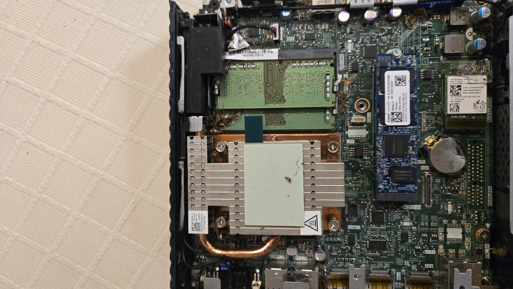

# Home-Lab Mini Rack Build Process

This document outlines the complete process of building a mini rack for my cloud engineering homelab. The goal is to create a self-sustaining environment to practice cloud engineering, networking, and automation.

## Equipment Used:
- Arris Surfboard S33
- Mikrotik RB5009
- 4x Dell Wyse 5070 Thin Clients
- Rack and cable management accessories
- Various tools for hardware maintenance

# BIOS Update for Dell Wyse 5070 (12/07/2025)

**Note: The Dell Wyse 5070 Thin Clients had bios versions ranging from 1.5.0 to 1.7.0 when I first recieved them.** 

## Steps:

### 1. Download the Latest BIOS Update
- Go to the official Dell support page: [Dell Wyse 5070 BIOS update](https://www.dell.com/support/product-details/en-us/product/wyse-5070-thin-client/drivers).
- Download the BIOS update file (version 1.39.0) for the Wyse 5070 Thin Client.

### 2. Prepare USB Drive
- Format a USB drive to **FAT32** format.
- Copy the BIOS update file onto the USB drive.

### 3. BIOS Update Procedure
- Power on the Wyse 5070 and press **F12** to enter the boot menu.
- Select **BIOS Flash Update** from the menu.
- Choose the BIOS update file from the USB drive.
- Confirm the update and allow the system to flash the BIOS. The system will reboot automatically once the update is complete.

### 4. Verification
- After the update is complete, enter the BIOS settings to verify that the update was successful.
- Check the BIOS version to ensure it matches the new version (1.39.0 as of 12/07/2025).

## **Upgrading RAM to 32GB on Wyse 5070** (12/07/2025)

### **Memory Considerations:**
- **CPU Limitation**: The **Intel J5005 CPU** can efficiently address only around **30 GB** of RAM. While you can install **32 GB**, about **2 GB will remain unaddressed** due to limitations in the CPU’s memory controller. 
- **Performance**: With **32 GB installed**, you’ll have **30 GB usable** in Linux. The remaining **2 GB** will be unused, but this does **not negatively impact system stability**.
- **Windows Users**: Windows will report **~29.8 GB usable** with **32 GB installed**. However, if you want to use all **32 GB**, you must disable **Secure Boot** and modify the boot configuration.

### **Upgrading Procedure**:
1. **Power off the Wyse 5070** and unplug it from the power source.
2. **Remove the back panel** by unscrewing the screws.
3. **Locate the RAM slot**: The Wyse 5070 typically supports up to **32 GB** of DDR4 SO-DIMM RAM.
4. **Install the new RAM**: Insert the 32 GB RAM module(s) into the slot. Make sure it clicks into place securely.
5. **Reassemble the device** and screw the back panel back in place.

### **Operating System Impact:**

#### **Linux**:
- **Usable RAM**: With 32 GB installed, **30 GB will be usable**. The additional 2 GB remains unaddressed due to CPU limitations, but this **does not affect system stability**.

#### **Windows**:
- **Secure Boot**: In order to use all 32 GB of RAM in Windows, you must disable **Secure Boot** in the BIOS.
- **Boot Configuration**: You also need to add a boot switch to Windows with the following command:
- `bcdedit /set {current} truncatememory 0x800000000`

## Step 4: Hardware Maintenance & Upgrades

### Cleaning Dead Bugs from Wyse Client (12/07/2025)

One of the Wyse 5070 units had an issue with internal dust and dead bugs. I used a vacuum cleaner to clean the components. Below is a photo of the unit after I opened it before it was cleaned:

This image shows the internal components of the device before cleaning.

## Mikrotik Wireguard VPN Setup (12/08/2025)

Setup following the directions listed [here](mikrotik-wireguard-vpn-setup.md)

# *1. Setup Proxmox Cluster* (12/24/2025)

Proxmox was installed on each node to be used as the hyprvisor. Next Tailscale was installed on each node in the Proxmox cluster for remote access. 

# *2. Setup Proxmox Repo and Backups* (12/27/2025)
Each node was updated to use the pve-no-subscription repo and configured to automatically create backups.

---

